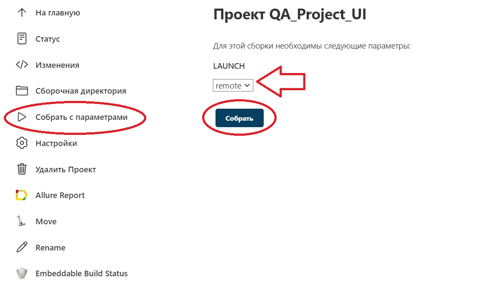

#  Проект по автоматизации тестирования сайта hh.ru

##	Содержание

- [Технологии и инструменты](#technologist-технологии-и-инструменты)
- [Реализованыe проверки](#bookmark_tabs-реализованные-проверки)
- [Запуск тестов](#computer-запуск-тестов)
- [Отчет о результатах тестирования в Allure Report](#-отчет-о-результатах-тестирования-в-Allure-report)
- [Интеграция с Allure TestOps](#-интеграция-с-allure-testops)
- [Интеграция с Jira](#-интеграция-с-jira)
- [Уведомления в Telegram с использованием бота](#-уведомления-в-telegram-с-использованием-бота)
- [Пример запуска теста в Selenoid](#-пример-запуска-теста-в-selenoid)


## :technologist: Технологии и инструменты

<code></code>
<code></code>
<code></code>
<code></code>
<code></code>
<code></code>
<code></code>
<code></code>
<code></code>
<code></code>
<code></code>

## :bookmark_tabs: Реализованные проверки:

- Проверка на наличие заголовка вакансии
- Проверка содержания заголовка вакансии
- Проверка названия вакансии на странице
- Поиск подзаголовка в тексте вакансии
- Проверка присутствия названия статьи, в результате ввода запроса в поиск
- Проверка отображения списка подкатегорий в выбранной категории 
- Поиск элемента в навигации страницы
- Проверка отсутсвия фавикона

## :computer: Запуск тестов

### Локальный запуск тестов производится из терминала среды разработки IntelliJ IDEA командой:
```bash
gradle clean test -Denv=local
```
#### Параметры сборки по умолчанию:

 <code>baseUrl</code> =https://ibs.ru - адрес сайта на котором запускаются тесты

 <code>browserName=chrome</code> - имя браузера

 <code>browserVersion=100</code> - версия браузера

 <code>browserSize=1920x1080</code> - размер экрана

 <code>isRemote=false</code> - проверка запуска теста локально


### Удаленный запуск тестов производится через программу [Jenkins](https://jenkins.autotests.cloud/job/QA-Project_UI/) через удаленный сервер 
#### для запуска тестов в программе нужно нажать "Собрать с параметрами" убедиться, что в графе LAUNCH_PARAMETR стоит параметр <code>remote</code>
#### и далее подтвердить нажав на кнопку "Собрать"
<p align="center">
  
</p>
В нижнем левом углу сборка начнет собираться. После окончания появится значок AllureTestOps и Allure Report.
Если сборка успешная до будет подветчиваться зеленым цветом. Также, в правом углу будет показан графический тренд изменения состояния
тестов от количества сборок.

<p align="center">
  
</p>

#### Параметры сборки по умолчанию:

 <code>baseUrl=https://ibs.ru</code> - адрес сайта на котором запускаются тесты

 <code>browserName=chrome</code> - имя браузера

 <code>browserVersion=100</code> - версия браузера

 <code>browserSize=1920x1080</code> - размер экрана

 <code>isRemote=true</code> - проверка запуска теста удаленно

 <code>remoteUrl=https://user:@selenoid.autotests.cloud/wd/hub</code> - адрес удаленного сервера (url изменен в целях безопасности)

## Отчет о результатах тестирования в [Allure Report](https://jenkins.autotests.cloud/job/tmaksyutov_diplom_ui/33/allure/)

Нажав на значки Allure Reзort и Allure TessOps можно посмотреть подробный отчет по тестам.

На данной странице все тесты прошли успешно, что показывает зеленая круговая диаграмма "STATUS"
<p align="center">
  
</p>

Тут два теста упали, а один тест был приостановлен 
<p align="center">
  
</p>

Если кликнуть
<p align="center">
  
</p>
